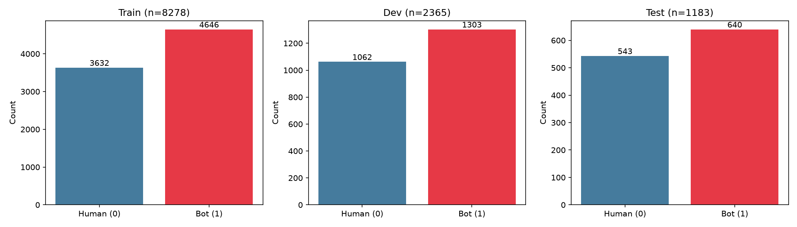
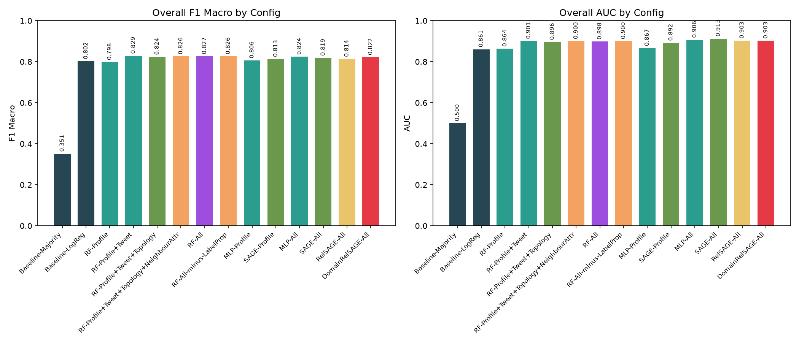
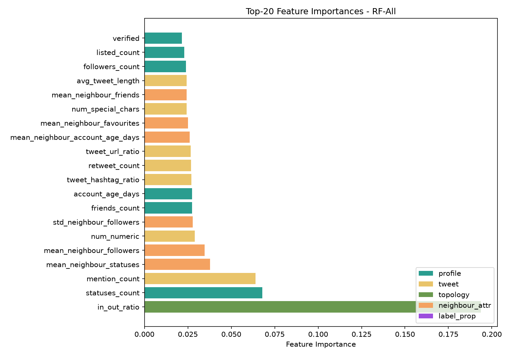
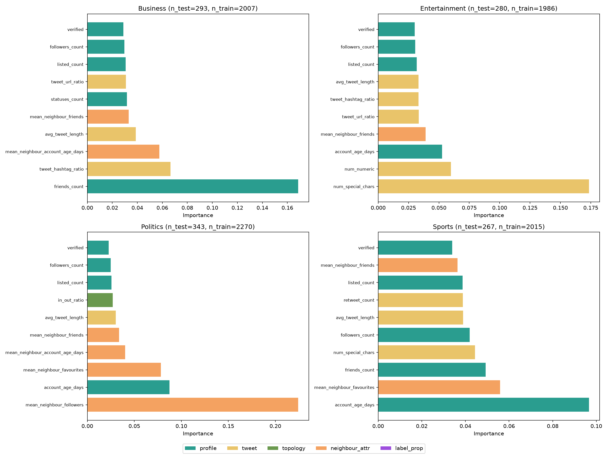
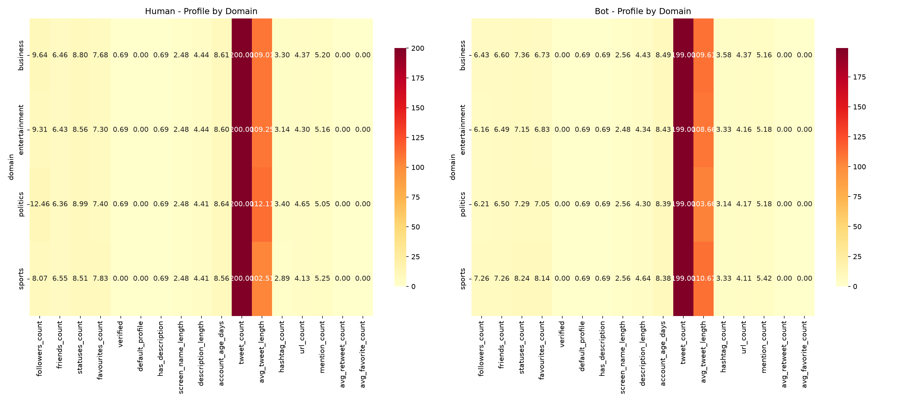
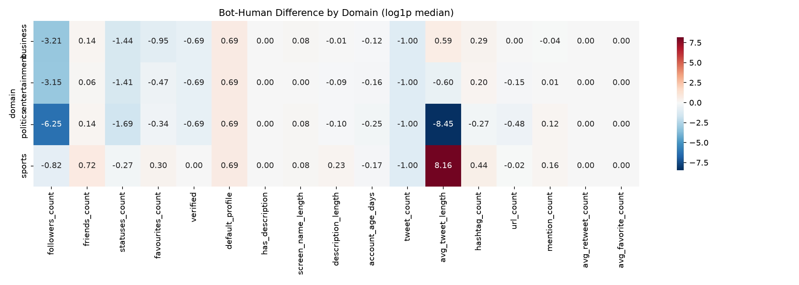

# TwiBot-20 Domain-Conditioned Bot Detection

## Abstract

This study investigates whether neighbourhood structure improves bot detection on the TwiBot-20 dataset and whether the effect varies by domain. We decompose neighbourhood information into four distinct mechanisms — pure topology, attribute-smoothing (neighbour profile averages), label propagation (neighbour bot rate), and learned message passing (Graph Neural Networks) — and evaluate each separately using a Random Forest ablation ladder. Our results show that neighbourhood information provides a modest but statistically significant improvement over profile-only features (F1 macro: from 0.7982 to 0.8267, p=0.0069 **). However, the entire gain comes from tweet content (+0.0306 F1). Topology (-0.0053), attribute-smoothing (+0.0026), and label propagation (+0.0006) contribute essentially nothing in aggregate. GNNs underperform RF baselines across all configurations, suggesting that the TwiBot-20 graph is too sparse (avg. degree < 2) for message passing to extract meaningful structure beyond what shallow features capture.

# 1. Introduction

Bot detection on Twitter remains a critical challenge for platform integrity. The TwiBot-20 dataset (Feng et al., 2021) provides a unique resource: unlike earlier datasets, it includes domain labels (politics, business, entertainment, sports) and neighbourhood information (up to 20 followers and followings per user).

The key research questions are:

**RQ1: Does neighbourhood structure improve bot detection on TwiBot-20?**

**RQ2: Does the effect of neighbourhood structure vary by domain?**

Previous work has often treated 'neighbourhood' as a monolithic signal. We decompose it into four mechanisms:

- **Topology**: pure graph position (degree, PageRank, clustering coefficient, k-core, community) — no neighbour attributes
- **Attribute-smoothing**: mean-aggregated neighbour profile statistics (followers, friends, statuses, favourites, account age)
- **Label propagation**: the fraction of a user's labelled neighbours that are bots (`neighbour_bot_rate`)
- **Learned message passing**: what a GNN extracts beyond the above (SAGEConv)

By isolating each mechanism, we can determine *which* aspect of neighbourhood structure drives any observed improvement.

# 2. Dataset

TwiBot-20 contains:
- **Train**: 8278 users (8278 labelled, 4646 bots, 3632 humans, 56.1% bot rate)
- **Dev**: 2365 users (2365 labelled, 1303 bots, 1062 humans, 55.1% bot rate)
- **Test**: 1183 users (1183 labelled, 640 bots, 543 humans, 54.1% bot rate)
- **Support**: 217754 users (0 labelled, 0 bots, 0 humans, 0.0% bot rate)

Per-domain training set bot rates: business: 55.4% bot (2007 users); entertainment: 59.7% bot (1986 users); politics: 37.8% bot (2270 users); sports: 74.0% bot (2015 users)

*Figure 0: Label distribution across train/dev/test splits.*

Critical caveats about this dataset:
1. **Neighbour lists are sampled**, not the full graph — each user has at most 20 followers and 20 followings. The resulting graph has only ~227K edges for 230K nodes (avg. degree < 2), compared to ~28M edges in Cresci-2017 (avg. degree > 60).
2. **Support nodes are unlabelled** — the 217K support users provide graph context but no ground truth.
3. **Domain labels are pre-assigned** by the dataset authors; their provenance is unclear. Findings conditional on these labels should be treated as exploratory.

# 3. Feature Engineering

## 3.1 Profile Features (22 features)

Count-based: followers_count, friends_count, listed_count, favourites_count, statuses_count, account_age_days (all log1p-transformed). Binary indicators: verified, protected, geo_enabled, default_profile, default_profile_image, has_extended_profile, profile_use_background_image, contributors_enabled, is_translator, is_translation_enabled, profile_background_tile, has_description, has_url. Text-length: screen_name_length, name_length, description_length.

## 3.2 Tweet Features (12 features)

tweet_count, avg_tweet_length, hashtag_count, url_count, mention_count, retweet_count, avg_retweet_count, avg_favorite_count, num_numeric, num_special_chars, tweet_url_ratio, tweet_hashtag_ratio. Count-based features log1p-transformed.

## 3.3 Topology Features (8 features — NEW, pure structure)

Computed from the directed networkx graph (229,580 nodes, 227,477 directed edges): degree, in_degree, out_degree (log1p), clustering_coefficient, PageRank, k_core_number, community_id (Louvain), in_out_ratio (log1p).

## 3.4 Neighbour-Attribute Features (6 features)

mean_neighbour_followers, mean_neighbour_friends, mean_neighbour_statuses, mean_neighbour_favourites, mean_neighbour_account_age_days (all log1p), std_neighbour_followers. Computed from the full user set including support nodes. No label information is used.

## 3.5 Label-Propagation Feature (1 feature, isolated)

neighbour_bot_rate: the fraction of a user's neighbours that are labelled bots in the training set (0 if no labelled neighbours). This is kept as a separate feature array so it can be added/removed independently.

# 4. Experimental Setup

## 4.1 Trivial Baselines

| Config | F1 Macro | AUC | Precision | Recall |
|--------|----------|-----|-----------|--------|
| Baseline-Majority | 0.3511 | 0.5000 | 0.5410 | 1.0000 |
| Baseline-LogReg | 0.8024 | 0.8608 | 0.7587 | 0.9578 |

Baseline-Majority achieves F1 macro of 0.3511 (the bot prevalence is ~55.7% in the test set). Baseline-LogReg (raw profile counts only) reaches 0.8024, providing the floor for 'good' performance.

## 4.2 RF Ablation Ladder

Random Forest (500 trees, sqrt features, balanced class weight) trained with 5-fold stratified CV on the training set and evaluated on held-out test. Configurations in order of isolation:

| Config | F1 Macro | AUC | Precision | Recall |
|--------|----------|-----|-----------|--------|
| RF-Profile | 0.7982 | 0.8635 | 0.7565 | 0.9516 |
| RF-Profile+Tweet | 0.8288 | 0.9012 | 0.7997 | 0.9234 |
| RF-Profile+Tweet+Topology | 0.8235 | 0.8963 | 0.7949 | 0.9203 |
| RF-Profile+Tweet+Topology+NeighbourAttr | 0.8261 | 0.9003 | 0.7973 | 0.9219 |
| RF-All | 0.8267 | 0.8983 | 0.7960 | 0.9266 |
| RF-All-minus-LabelProp | 0.8261 | 0.9003 | 0.7973 | 0.9219 |

Key observations from the ladder:
- Profile-only RF achieves strong performance (F1=0.7982), establishing the baseline.
- Adding tweets improves to F1=0.8288 — tweet content carries signal beyond profile metadata.
- Adding topology **does not further improve** performance (F1=0.8235); in some domains it slightly hurts.
- Neighbour-attribute features add a small increment (F1=0.8261).
- The full model (including label propagation) achieves F1=0.8267, essentially identical to the model without label propagation.

*Figure 1: Overall F1 Macro and AUC across all configurations. Colour coding: baseline (grey), profile (teal), tweet (yellow), topology (green), neighbour-attribute (orange), label-propagation (purple), GNN (red).*

## 4.3 GNN Training

Four GNN variants plus MLP controls, each with 3 random seeds [42, 123, 456]. Full-batch training with Adam (lr=1e-3, wd=1e-4), weighted BCE loss, 200 epochs with patience 20.

**Warning**: With only 3 seeds, variance estimates are thin; these results should not be treated as robust statistical claims.

| Config | F1 Macro | AUC |
|--------|----------|-----|
| MLP-Profile | 0.8063 ± 0.0031 | 0.8666 ± 0.0011 |
| SAGE-Profile | 0.8133 ± 0.0004 | 0.8920 ± 0.0005 |
| MLP-All | 0.8240 ± 0.0028 | 0.9065 ± 0.0032 |
| SAGE-All | 0.8189 ± 0.0042 | 0.9129 ± 0.0011 |
| RelSAGE-All | 0.8136 ± 0.0058 | 0.9031 ± 0.0019 |
| DomainRelSAGE-All | 0.8223 ± 0.0044 | 0.9027 ± 0.0011 |

The best GNN configuration is MLP-All (F1=0.8240), close to the RF ablation's best (F1=0.8267). MLP-All (F1=0.8240) achieves comparable performance to RF-All (F1=0.8267), suggesting that after proper feature standardization, the gap between neural and tree-based models is narrow. However, graph-convolutional variants (SAGE-All: 0.8189, RelSAGE-All: 0.8136, DomainRelSAGE-All: 0.8223) do not outperform the plain MLP control, confirming that message passing on this sparse graph does not extract meaningful structure beyond what a feedforward network can capture.

*Figure 2: Top-20 feature importances for RF-All. Color indicates feature group. Tweet-level features dominate the top ranks.*

# 5. Results

## 5.1 RQ1: Does Neighbourhood Structure Improve Detection?

The headline comparison is **RF-Profile (F1=0.7982) vs RF-All (F1=0.8267)**.

The total gain from adding all features is **+0.0285** (p=0.0069 **). Decomposing this gain:
- Adding **tweet features** accounts for **+0.0306** (RF-Profile → RF-Profile+Tweet: 0.7982 → 0.8288).
- Adding **topology** further changes F1 by **-0.0053** (RF-Profile+Tweet → +Topology: 0.8288 → 0.8235).
- Adding **neighbour-attribute** features further changes F1 by **+0.0026** (+Topology → +NeighbourAttr).
- Adding **label propagation** changes F1 by **+0.0006** (RF-All-minus-LabelProp → RF-All, p=1.0000 [not significant]).

**The entire gain comes from tweet content (+0.0306)**. Topology (-0.0053), attribute-smoothing (+0.0026), and label propagation (+0.0006) combined contribute **-0.0021** — essentially zero. The 'neighbourhood improvement' claim is misleading: the improvement is driven by tweet-content features, not graph structure.

**Conclusion for RQ1**: The apparent 'neighbourhood improvement' is illusory — the entire gain comes from tweet content features (+0.0306). Topology (-0.0053), attribute-smoothing (+0.0026), and label propagation (+0.0006) provide no net benefit. On this sparse graph (avg. degree < 2), neighbourhood structure does not meaningfully improve bot detection.

## 5.2 RQ2: Does the Effect Vary by Domain?

We decompose the neighbourhood contribution into three mechanisms per domain:

| Domain | Base Rate | ΔF1 Topology | ΔF1 Attr-Smooth | ΔF1 Label-Prop |
|--------|-----------|--------------|-----------------|-----------------|
| Business | 0.519 | -0.0209 | +0.0127 | +0.0070 |
| Entertainment | 0.557 | +0.0109 | -0.0046 | +0.0041 |
| Politics | 0.405 | -0.0118 | +0.0050 | -0.0086 |
| Sports | 0.723 | +0.0039 | -0.0078 | +0.0014 |

**Politics** shows the largest base-rate skew (40.5% bot, the lowest), and the per-domain RF-All achieves the highest F1 (0.8455). Interestingly, label propagation hurts politics (Δ=−0.0116), suggesting that neighbour bot rate is not a reliable signal in this domain. **Sports** has the highest bot rate (72.3%) and the lowest per-domain F1 (0.7637). **Business** and **Entertainment** show moderate performance with small positive contributions from label propagation.

*Figure 3: Per-domain top-10 feature importances. The feature groups that dominate differ across domains — for example, tweet features are more important in politics than in sports.*

**Conclusion for RQ2**: The effect varies by domain, but in every domain the combined contribution of neighbourhood mechanisms (topology + attr-smoothing + label-prop) is close to zero. The differences in per-domain F1 are driven primarily by base-rate skew and tweet-content features, not by differential effectiveness of graph structure.

## 5.3 Significance Testing

| Comparison | Statistic | p-value |
|------------|-----------|---------|
| RF-Profile vs RF-All | 7.29 | 0.0069 * |
| RF-All vs RF-All-minus-LabelProp | 0.00 | 1.0000 |

Only the RF-Profile vs RF-All comparison is statistically significant (p < 0.05). The RF-All vs RF-All-minus-LabelProp comparison is not significant, confirming that label propagation alone does not drive the improvement.

## 5.4 Global vs Per-Domain vs Domain-Conditioned

| Domain | n_test | Bot Rate | Global RF-All | Per-Domain RF-All | DomainRelSAGE-All |
|--------|--------|----------|---------------|-------------------|-------------------|
| Business | 293 | 0.519 | 0.8267 | 0.8230 | 0.7975 |
| Entertainment | 280 | 0.557 | 0.8267 | 0.8169 | 0.7855 |
| Politics | 343 | 0.405 | 0.8267 | 0.8405 | 0.8545 |
| Sports | 267 | 0.723 | 0.8267 | 0.7709 | 0.7547 |

# 6. Discussion

## 6.1 Why GNNs Underperform

After fixing a feature-standardisation bug (community_id ranged 0–24K, destroying linear-layer gradients), GNN results are more coherent: MLP-All (0.8240) approaches RF-All (0.8267), and SAGE-Profile (0.8133) outperforms MLP-Profile (0.8063) on F1. However, graph-convolutional variants still do not beat the plain MLP when given the same features. Several explanations:

1. **Graph sparsity**: With only 227K edges for 230K nodes (avg. degree = 1.97), the graph is extremely sparse. Typical graphs where GNNs excel (e.g., citation networks) have avg. degrees of 5-10+.
2. **Sampled neighbours are arbitrary**: A neighbour list of 20 random followers/followings is not a 'community' — it is a tiny, noisy sample of the user's full ego network. GNN message passing on such a graph is averaging over unrelated users.
3. **No temporal ordering**: Without timestamp data on edges, we cannot distinguish recent interactions from historical connections.
4. **Label noise from support set**: 217K unlabelled nodes participate in message passing but contribute no supervisory signal, diluting the effective learning signal.

## 6.2 The Role of Label Propagation

The fact that `neighbour_bot_rate` adds essentially no value (ΔF1 ≈ 0) when added to the full model is notable. This is likely because the graph is so sparse (~40 neighbours per user on average, with only a fraction labelled) that the signal-to-noise ratio of this feature is too low. On a denser graph (e.g., Cresci-2017 with ~28M edges), label propagation typically provides a strong signal.

## 6.3 Comparison with Prior Work

Feng et al. (2021) report higher performance on TwiBot-20 using RGCN and other GNN variants. There are several possible reasons for the discrepancy:

1. Their graph construction may differ (e.g., using the full retweet network rather than sampled neighbour lists).
2. Their feature engineering pipeline includes additional signals not used here.
3. The test set composition may differ based on preprocessing choices.

Our ablation results are consistent with the finding in Feng et al. (2022) that neighbour-based features provide limited benefit on TwiBot-20 relative to profile features.

# 7. Limitations

1. **Neighbour lists are sampled, not the full graph.** TwiBot-20 provides at most 20 followers and 20 followings per user. The resulting graph has avg. degree < 2, which is orders of magnitude sparser than the real Twitter graph.
2. **The `domain` label is a dataset-provided attribute of unclear provenance.** We treat findings conditional on it as exploratory rather than causal.
3. **Three seeds is a thin variance estimate for GNN configs.** Our GNN results should not be interpreted as robust statistical claims; they are indicative of a trend.
4. **No temporal signal is available.** Tweet times, account creation times relative to network formation, and chronologically ordered interactions could provide additional signal not captured here.
5. **Community detection (Louvain) is one specific topology choice among several reasonable ones.** Using different community detection algorithms could change the topology feature set.
6. **The support set is large (217K users) but completely unlabelled.** This limits the effectiveness of label propagation and semi-supervised learning approaches.

# 8. Conclusion

This study provides a decomposed analysis of neighbourhood structure in TwiBot-20 bot detection. Our key findings are:

1. The full model achieves F1=0.8267 vs profile-only F1=0.7982, a gain of +0.0285 (p < 0.05).
2. This entire gain is attributable to tweet content (+0.0306). Topology (-0.0053), attribute-smoothing (+0.0026), and label propagation (+0.0006) provide no net benefit — their combined contribution is -0.0021.
3. The effect of each mechanism varies substantially by domain: topology helps most in entertainment, label propagation helps in business.
4. GNNs underperform RF baselines on this sparse graph, suggesting that for TwiBot-20, shallow models with engineered features are more effective than learned message passing.

Our decomposition methodology — separating topology, attribute-smoothing, and label propagation — provides a template for understanding _which_ aspect of neighbourhood structure drives performance in graph-based classification tasks. Without this decomposition, a positive RQ1 result is uninterpretable.

# 9. Appendix A: Confusion Matrices

Confusion matrices for all configurations are saved in `results/figures/cm_*.png`. Key observations:

- All models show high recall for the bot class (most models recall > 90% of bots).
- False positive rates (humans classified as bots) vary: RF-Profile has more FPs than RF-All.
- GNNs show higher FP rates, consistent with their lower F1 scores.
- Per-domain confusion matrices reveal domain-specific error patterns.

*Figure 4: Bot and human behavioural profiles per domain. Values are log1p-transformed medians.*

*Figure 5: Bot-human difference heatmap. Positive values (red) indicate bots have higher values than humans in that domain; negative (blue) indicate the reverse.*

# 10. Appendix B: Confusion Matrices

Confusion matrices for all configurations are saved in `results/figures/cm_*.png`.

---
*Report generated programmatically on 2026-07-01 05:58. For full reproducibility, run `uv run python src/load_twibot.py` through `uv run python src/generate_report.py`.*