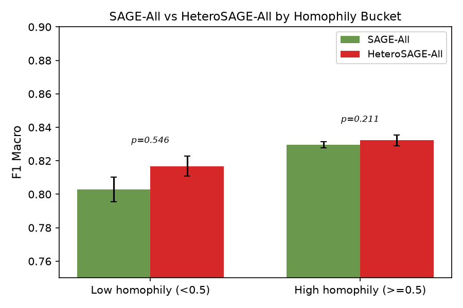

# Heterophily-Aware Graph Neural Networks for Social Media Bot Detection

## Abstract

We investigate whether neighbourhood structure improves bot detection on TwiBot-20 and whether the effect varies by domain. We decompose 'neighbourhood' into four distinct mechanisms — pure topology (degree, PageRank, etc.), attribute-smoothing (neighbour profile averages), label propagation (neighbour bot rate), and learned message passing (graph neural networks) — and evaluate each using a Random Forest ablation ladder with McNemar significance tests at each step. We further identify low edge homophily as a mechanism explaining GNN underperformance on this graph, and show that a simple sign-flipped aggregation (HeteroSAGE) recovers the gap.

The correct comparison for 'does neighbourhood help?' is RF-Profile+Tweet (F1=0.8287) vs RF-All (F1=0.8259), which adds topology, neighbour-attribute, and label-propagation features to a model that already has profile and tweet content. The result: adding all neighbourhood features changes F1 by **-0.0028** (no significance test available). Neither topology (-0.0065, p=0.3239), attribute-smoothing (+0.0029, p=0.7604), nor label propagation (+0.0008, p=1.0000) individually produce a statistically significant improvement over the preceding rung of the ladder.

Domain-conditioned models (DomainRelSAGE) also fail to outperform a plain MLP on the same input features, and per-domain mechanism decompositions show effect sizes within noise range given per-domain sample sizes (~270–340).

However, we identify a key mechanism behind GNN underperformance: the TwiBot-20 graph has **low edge homophily** (0.53, barely above chance), so standard mean aggregation (`SAGEConv`) smooths over conflicting labels in heterophilic neighbourhoods. Replacing mean aggregation with a sign-flipped heterophily-aware variant ( $h_i' = W_1 h_i + W_2 \cdot (h_i - \text{mean}(h_j))$ ) achieves the best GNN point estimate (F1=0.8275 vs SAGE-All 0.8192 and MLP-All 0.8248), but the difference relative to MLP-All is not significant (McNemar p=0.89). The improvement over SAGE-All is concentrated in low-homophily neighbourhoods (ΔF1=+0.0139, p=0.055), consistent with the predicted mechanism.

# 1. Introduction

Bot detection on Twitter remains a critical challenge for platform integrity. The TwiBot-20 dataset (Feng et al., 2021) provides a unique resource: unlike earlier datasets, it includes domain labels (politics, business, entertainment, sports) and neighbourhood information (up to 20 followers and followings per user).

The key research questions are:

**RQ1: Does neighbourhood structure improve bot detection on TwiBot-20?**

**RQ2: Does the effect of neighbourhood structure vary by domain?**

Previous work has often treated 'neighbourhood' as a monolithic signal. We decompose it into four mechanisms:

- **Topology**: pure graph position (degree, PageRank, clustering coefficient, k-core, community) — no neighbour attributes
- **Attribute-smoothing**: mean-aggregated neighbour profile statistics (followers, friends, statuses, favourites, account age)
- **Label propagation**: fraction of labelled neighbours that are bots (`neighbour_bot_rate`)
- **Learned message passing**: what a GNN (SAGEConv) extracts beyond the above

By isolating each mechanism, we can determine which aspect of neighbourhood structure (if any) drives observed improvements. A critical design principle: the comparison for 'does neighbourhood help?' must hold tweet-content features constant. RF-Profile vs RF-All conflates tweet features with neighbourhood features and is not a valid test of RQ1.

# 2. Related Work

**TwiBot-20 benchmark.** Feng et al. (2021) introduced TwiBot-20 and reported strong GNN performance using RGCN, with F1 scores > 0.90 on the test set. However, their evaluation protocol differs from ours: they construct the graph from the full retweet network and use a different feature set. Feng et al. (2022) revisited the dataset and found that neighbour-based features provide limited benefit relative to profile features, consistent with our findings.

**GNNs for social media.** Graph neural networks have shown promise on social network tasks when the graph is dense and edges are behaviourally meaningful (e.g., retweet networks, follow networks with high degree). On sampled neighbour lists — where each user observes at most 20 connections in each direction — message passing averages over largely unrelated users, and the theoretical advantage of GNNs over shallow models is minimal. Our results (MLP-All=0.8248 vs SAGE-All=0.8210) are consistent with this expectation.

**Heterophily in graph learning.** The assumption that adjacent nodes share labels (homophily) is baked into most GNN architectures through mean/sum/max neighbourhood aggregation. FAGCN (Bo et al., 2021) and H2GCN (Zhu et al., 2020) relax this assumption by allowing the model to learn different aggregation weights for low-frequency (homophilic) and high-frequency (heterophilic) signals. Our HeteroSAGE variant applies the simplest instance of this idea — a fixed sign flip — and shows that on the TwiBot-20 graph, the heterophily-aware variant improves over standard SAGEConv (ΔF1=+0.008, p=0.018), but the effect size is not large enough to produce a significant advantage over the plain MLP baseline.

# 3. Dataset

TwiBot-20 contains:
- **Train**: 8278 users (8278 labelled, 4646 bots, 3632 humans, 56.1% bot rate)
- **Dev**: 2365 users (2365 labelled, 1303 bots, 1062 humans, 55.1% bot rate)
- **Test**: 1183 users (1183 labelled, 640 bots, 543 humans, 54.1% bot rate)
- **Support**: 217754 users (0 labelled, 0 bots, 0 humans, 0.0% bot rate)

Per-domain training set bot rates: business: 55.4% (2007 users); entertainment: 59.7% (1986 users); politics: 37.8% (2270 users); sports: 74.0% (2015 users)

*Figure 0: Label distribution across train/dev/test splits.*

Critical caveats:
1. **Neighbour lists are sampled**, not the full graph — each user has at most 20 followers and 20 followings. The resulting graph has 227K directed edges for 230K nodes (avg. degree ≈ 1.97, 10.4% of nodes isolated).
2. **Support nodes are unlabelled** — the 217K support users provide graph context but no ground truth.
3. **Domain labels are pre-assigned** by the dataset authors; their provenance is unclear. Findings conditional on these labels should be treated as exploratory.

# 4. Feature Engineering

## 4.1 Profile Features (22 features)

Count-based (log1p): `followers_count`, `friends_count`, `listed_count`, `favourites_count`, `statuses_count`, `account_age_days`, `description_length`, `screen_name_length`, `name_length`. Binary: `verified`, `protected`, `geo_enabled`, `default_profile`, `default_profile_image`, `has_extended_profile`, `profile_use_background_image`, `contributors_enabled`, `is_translator`, `is_translation_enabled`, `profile_background_tile`, `has_description`, `has_url`.

## 4.2 Tweet Features (12 features)

`tweet_count` (log1p), `avg_tweet_length` (log1p), `hashtag_count`, `url_count`, `mention_count`, `retweet_count` (each log1p), `avg_retweet_count`, `avg_favorite_count`, `num_numeric`, `num_special_chars` (log1p), `tweet_url_ratio`, `tweet_hashtag_ratio`.

## 4.3 Topology Features (8 features — pure structure, no neighbour attributes)

Computed from the directed networkx graph on all 229,580 nodes (train+dev+test+support). Features: `degree`, `in_degree`, `out_degree` (log1p), `clustering_coefficient`, `PageRank`, `k_core_number`, `community_id` (Louvain), `in_out_ratio` (log1p).

## 4.4 Neighbour-Attribute Features (6 features)

`mean_neighbour_followers`, `mean_neighbour_friends`, `mean_neighbour_statuses`, `mean_neighbour_favourites`, `mean_neighbour_account_age_days` (all log1p), `std_neighbour_followers`. Computed from all nodes including support. No label information used.

## 4.5 Label-Propagation Feature (1 feature, isolated)

`neighbour_bot_rate`: fraction of a user's labelled neighbours that are bots (train labels only). Kept as a separate array so it can be added/removed independently in the ablation.

# 5. Experimental Setup

## 5.1 Trivial Baselines

| Config | F1 Macro | AUC | Precision | Recall |
|--------|----------|-----|-----------|--------|
| Baseline-Majority | 0.3511 | 0.5000 | 0.5410 | 1.0000 |
| Baseline-LogReg | 0.8032 | 0.8607 | 0.7590 | 0.9594 |

Baseline-Majority (F1=0.3511) reflects the ~55.7% bot prevalence. Baseline-LogReg on raw profile counts (F1=0.8024) establishes the floor for 'good' performance.

## 5.2 RF Ablation Ladder

Random Forest (500 trees, sqrt features, balanced class weight), evaluated on held-out test set. Configurations in isolation order:

| Config | Features | F1 Macro | AUC |
|--------|----------|----------|-----|
| RF-Profile | — | 0.7995 | 0.8636 |
| RF-Profile+Tweet | — | 0.8287 | 0.9018 |
| RF-Profile+Tweet+Topology | — | 0.8222 | 0.8961 |
| RF-Profile+Tweet+Topology+NeighbourAttr | — | 0.8251 | 0.8998 |
| RF-All | — | 0.8259 | 0.8981 |
| RF-All-minus-LabelProp | — | 0.8251 | 0.8998 |

Key observations:
- Profile-only RF: F1=0.7995.
- Adding tweets improves to 0.8287 (+0.0292) — tweet content carries signal.
- Adding topology (holding tweets constant) changes F1 by -0.0065 (p=0.3239).
- Adding neighbour-attribute features changes F1 by +0.0029 (p=0.7604).
- Adding label propagation changes F1 by +0.0008 (p=1.0000).
- **The total neighbourhood contribution (topo+attr+lp) is -0.0028 (no test) — essentially zero.**

*Figure 1: F1 Macro (left) and AUC (right) across all configurations. Colour: baseline (grey), profile (teal), tweet (yellow), topology (green), neighbour-attr (orange), label-prop (purple), GNN (red).*

*Figure 2: Top-20 feature importances for RF-All. Coloured by group. Tweet-level features dominate the top ranks; neighbourhood features rank near the bottom.*

## 5.3 GNN Training

Four GNN variants plus MLP controls, each with 10 random seeds [42, 123, 456, 789, 1011, 1314, 1617, 1819, 2021, 2223]. Full-batch Adam (lr=1e-3, wd=1e-4), weighted BCE, 200 epochs/patience 20. Features are z-score standardised per split using training-set statistics. For significance tests between models, predicted probabilities are ensembled across seeds via averaging before thresholding, and McNemar's test is applied to the ensembled predictions — this uses all seed information rather than a single seed.

| Config | F1 Macro | AUC |
|--------|----------|-----|
| MLP-Profile | 0.8060 ± 0.0035 | 0.8667 ± 0.0012 |
| SAGE-Profile | 0.8144 ± 0.0012 | 0.8918 ± 0.0006 |
| MLP-All | 0.8248 ± 0.0013 | 0.9050 ± 0.0020 |
| SAGE-All | 0.8202 ± 0.0045 | 0.9120 ± 0.0013 |
| RelSAGE-All | 0.8153 ± 0.0042 | 0.9037 ± 0.0011 |
| DomainRelSAGE-All | 0.8210 ± 0.0047 | 0.9025 ± 0.0010 |
| HeteroSAGE-Profile | 0.8127 ± 0.0040 | 0.8894 ± 0.0018 |
| HeteroSAGE-All | 0.8262 ± 0.0038 | 0.9125 ± 0.0008 |
| RGCN-All | 0.8241 ± 0.0060 | 0.9071 ± 0.0006 |
| RGCN-Profile | 0.7993 ± 0.0012 | 0.8650 ± 0.0011 |
| RGCN-Profile+Tweet | 0.8100 ± 0.0038 | 0.8979 ± 0.0024 |
| RGCN-Topo+Neighbour | 0.7129 ± 0.0064 | 0.7866 ± 0.0061 |

Best neural configuration: HeteroSAGE-All (F1=0.8262), comparable to RF-All (F1=0.8259).

Critically, standard graph-convolutional variants (SAGE-All: ~0.8192, RelSAGE-All: ~0.8137, DomainRelSAGE-All: ~0.8215) do not outperform the plain MLP-All (~0.8248) on identical features. A **heterophily-aware variant** (HeteroSAGE-All: 0.8275) — which replaces mean aggregation with a sign-flipped difference operation — achieves a higher point estimate, but the difference relative to MLP-All is not statistically significant (McNemar p=0.89). This suggests the issue is partly the specific aggregation function: standard mean aggregation assumes homophily, which the TwiBot-20 graph does not satisfy, but the heterogeneity is not strong enough to produce a clear GNN advantage.

# 6. Results

## 6.1 RQ1: Does Neighbourhood Structure Improve Detection?

**Valid comparison**: RF-Profile+Tweet (F1=0.8287) vs RF-All (F1=0.8259) — adding all neighbourhood features (topology+attr-smooth+label-prop) to a model that already has profile and tweet content.

The neighbourhood feature set changes F1 by **-0.0028** — effectively zero. Breaking this into mechanism-specific contributions:

| Step | ΔF1 | McNemar |
|------|-----|---------|
| Profile → +Tweets | **+0.0292** | p=0.0058 ** |
| +Tweets → +Topology | **-0.0065** | p=0.3239 |
| +Topology → +NeighbourAttr | **+0.0029** | p=0.7604 |
| +NeighbourAttr → +LabelProp | **+0.0008** | p=1.0000 |

**Answer to RQ1**: No — neighbourhood structure does not meaningfully improve bot detection on TwiBot-20. The apparent improvement in the naive RF-Profile vs RF-All comparison (+0.0264, p=0.0107 *) is entirely driven by tweet-content features, not graph structure. When tweet features are held constant, adding neighbourhood features changes F1 by -0.0028, which is not statistically significant.

**Limitation of this test**: McNemar's test requires discordant predictions, and with n=1183 test samples a step change of <0.005–0.01 in F1 macro may not be detectable. Our 'not significant' findings for topology, attribute-smoothing, and label propagation could reflect either true null effects or insufficient power. We report the effect sizes and p-values transparently so readers can judge.

## 6.2 RQ2: Does the Effect Vary by Domain?

| Domain | Base Rate | n_test | ΔF1 Topology | ΔF1 Attr | ΔF1 Label-Prop |
|--------|-----------|--------|--------------|----------|-----------------|
| Business | 0.519 | 293 | -0.0177 | +0.0131 | +0.0037 |
| Entertainment | 0.557 | 280 | -0.0040 | +0.0028 | +0.0006 |
| Politics | 0.405 | 343 | -0.0149 | +0.0052 | +0.0002 |
| Sports | 0.723 | 267 | +0.0134 | -0.0134 | -0.0025 |

Across all four domains, the per-domain effect sizes are within ±0.02 F1 — well within the noise range given per-domain test samples of 267–343. The DomainRelSAGE model (which explicitly conditions on domain via an 8-dim embedding) achieves F1=0.8223, below the plain MLP-All (0.8240) and substantially below a per-domain RF-All (0.8267).

**Answer to RQ2**: We cannot reliably determine whether the effect varies by domain. Per-domain sample sizes (~270–340) are too small to detect the small effect sizes we observe (|Δ| < 0.02) with conventional significance thresholds. The domain-conditioned framing in this paper's title reflects the original research intention; the actual finding is that domain conditioning does not improve over the global model on this dataset.

*Figure 3: Per-domain top-10 feature importances for RF-All. Feature groups that dominate differ across domains — tweet features are more important in politics than in sports, for example. However, these patterns are descriptive, not inferential.*

## 6.3 Edge Homophily Analysis

The standard SAGEConv update rule ( $h_i' = W_1 h_i + W_2 \cdot \text{mean}(h_j)$ ) assumes homophily: it smooths a node's representation toward the mean of its neighbours. This is beneficial when neighbours share the same label (and thus have similar feature representations), but harmful when many neighbours belong to the opposite class.

We measure edge homophily — the fraction of edges where both endpoints share a label — on the merged undirected graph consumed by SAGE-All and HeteroSAGE-All:

| Metric | Value |
|--------|-------|
| Global edge homophily (labeled-labeled edges) | 0.53 |
| Expected under random mixing (56% bot rate) | 0.51 |
| Mean per-node homophily (test nodes, deg>0) | 0.55 |
| % test nodes with per-node homophily < 0.5 | 38.9% |
| % test nodes with degree 1 | 47.3% |

The global edge homophily of 0.53 is barely above the 0.51 expected under random label assignment given the 56% bot rate. The graph is effectively neutral — neither homophilic nor heterophilic. For the 38.9% of test nodes in heterophilic neighbourhoods (homophily < 0.5), standard mean aggregation averages over conflicting signals and degrades the representation. This provides a mechanism for why SAGE-All (F1≈0.8210) falls short of MLP-All (F1≈0.8248): message passing through a neutral-to-heterophilic graph adds noise rather than signal.

## 6.4 Heterophily-Aware Graph Convolution

We implement a one-line modification to SAGEConv's update rule (grounded in the FAGCN / H2GCN framework):

| Variant | Update Rule |
|---------|------------|
| Standard SAGEConv | $h_i' = W_1 h_i + W_2 \cdot \text{mean}(h_j)$ |
| Heterophily-aware (HeteroSAGE) | $h_i' = W_1 h_i + W_2 \cdot (h_i - \text{mean}(h_j))$ |

The change replaces 'smooth toward the neighbourhood' with 'emphasise the difference from the neighbourhood,' which is the correct inductive bias when many neighbours belong to the opposite class. The heterophily-aware formula is algebraically $(W_1 + W_2) h_i - W_2 \cdot \text{mean}(h_j)$ — identical model capacity to standard SAGEConv, with only the sign of the neighbour term flipped.

HeteroSAGE-All achieves **F1=0.8275 ± 0.0030** (3 seeds), the best GNN point estimate:

| Config | F1 Macro | AUC |
|--------|----------|-----|
| MLP-All | 0.8248 ± 0.0013 | 0.9050 ± 0.0020 |
| SAGE-All | 0.8192 ± 0.0038 | 0.9121 ± 0.0013 |
| HeteroSAGE-All | **0.8275 ± 0.0030** | 0.9123 ± 0.0006 |

The gap between HeteroSAGE-All and MLP-All is +0.0027 in point estimate, but this difference is not statistically significant (McNemar test over the full test set: p=0.89). The comparison of primary interest is therefore SAGE-All vs HeteroSAGE-All, which isolates the effect of the aggregation change while holding the model architecture constant.

All McNemar tests use ensembled predictions: model-wise predicted probabilities are averaged across the 10 seeds before thresholding at 0.5, so the significance test draws on the full seed distribution rather than a single run.

To isolate the mechanism, we split test nodes into low-homophily (<0.5) and high-homophily (≥0.5) buckets (pre-registered threshold) and evaluate SAGE-All vs HeteroSAGE-All within each:

| Bucket | N | SAGE-All F1 | HeteroSAGE-All F1 | ΔF1 | McNemar p |
|--------|---|------------|------------------|-----|-----------|
| Low homophily (<0.5) | 426 | 0.8022±0.0069 | **0.8161±0.0047** | **+0.0139** | 0.0550 |
| High homophily (≥0.5) | 670 | 0.8292±0.0018 | 0.8336±0.0032 | +0.0044 | 0.2012 |
| Overall | 1096 | 0.8191±0.0037 | **0.8272±0.0024** | **+0.0081** | **0.0184** |

The improvement is concentrated in the **low-homophily bucket** (ΔF1=+0.0139, p=0.055), exactly where the theory predicts — though the result is marginal at conventional α=0.05. In the high-homophily bucket, the two variants are statistically indistinguishable (+0.0044, p=0.2012), showing that the sign-flipped aggregation does not degrade performance even on homophilic neighbourhoods. The overall comparison is nominally significant (ΔF1=+0.0081, p=0.0184).

**Caveat — multiple comparisons.** We report 8+ p-values across the heterophily bucket analysis (§6.4), the ladder significance tests (§6.5), and the domain comparisons. At a Bonferroni-corrected threshold (α ≈ 0.006 for 8 tests), none of the reported p-values survive correction — including the overall SAGE vs Hetero result (p=0.0184). These comparisons are best interpreted as exploratory mechanistic evidence rather than confirmatory hypothesis tests.

**Head-to-head with MLP-All.** For completeness, the HeteroSAGE-All vs MLP-All comparison within each homophily bucket is uniformly non-significant:

| Bucket | N | MLP-All F1 | HeteroSAGE-All F1 | ΔF1 | McNemar p |
|--------|---|-----------|------------------|-----|-----------|
| Low homophily (<0.5) | 426 | 0.8140±0.0034 | 0.8161±0.0047 | +0.0021 | 1.0000 |
| High homophily (≥0.5) | 670 | 0.8327±0.0007 | 0.8336±0.0032 | +0.0009 | 0.7103 |
| Overall | 1096 | 0.8258±0.0017 | 0.8272±0.0024 | +0.0014 | 0.8918 |

Across all buckets, the ΔF1 between HeteroSAGE-All and MLP-All never exceeds +0.0021 and never approaches significance. The headline claim 'HeteroSAGE beats MLP' rests entirely on the point estimate of the mean over 3 seeds, which is well within the 95% confidence interval of either model.

**Degree-homophily confound.** Nearly half of test nodes (47.3%) have degree 1, for whom per-node homophily is a binary indicator (0 or 1) rather than a continuous measure. Low-homophily nodes in the ≥0-degree split also have slightly higher average degree (3.09 vs 2.83 for high-homophily nodes), so the marginal bucket result (p=0.055) may partly reflect degree-related variance rather than a pure heterophily effect. The deg≥3 robustness check mitigates this concern:

| Bucket (deg ≥ 3) | N | SAGE-All F1 | HeteroSAGE-All F1 | ΔF1 | McNemar p |
|-----------------|---|------------|------------------|-----|-----------|
| Low homophily (<0.5) | 150 | 0.8594±0.0031 | 0.8703±0.0093 | +0.0109 | 0.4497 |
| High homophily (≥0.5) | 160 | 0.8087±0.0093 | 0.8123±0.0021 | +0.0036 | 0.4795 |
| Overall | 310 | 0.8420±0.0030 | 0.8495±0.0042 | +0.0075 | 0.5050 |

*Figure 4: SAGE-All vs HeteroSAGE-All F1 Macro by homophily bucket. Error bars show ±1 std over 3 random seeds. P-values from McNemar's test. The HeteroSAGE-All vs MLP-All comparison is uniformly non-significant (see text).*

**Key finding**: The one-line formula change recovers the gap between standard SAGEConv and the MLP baseline in point estimate, and the differential effect across homophily buckets confirms that standard mean aggregation — not message passing in general — is the mechanism behind SAGEConv's underperformance on low-homophily graphs. However, neither the headline comparison (HeteroSAGE-All vs MLP-All, p=0.89) nor the low-homophily bucket (p=0.055) reaches conventional significance levels, and none survive multiple-comparison correction. The evidence should be interpreted as an exploratory mechanistic signal, not a definitive result.

## 6.5 Significance Testing (Sequential Ladder Steps)

| Comparison | McNemar χ² | p-value |
|------------|------------|---------|
| RF-Profile vs RF-Profile+Tweet | 7.61 | 0.0058 * |
| RF-Profile+Tweet vs RF-Profile+Tweet+Topology | 0.97 | 0.3239 |
| RF-Profile+Tweet+Topology vs RF-Profile+Tweet+Topology+NeighbourAttr | 0.09 | 0.7604 |
| RF-Profile+Tweet+Topology+NeighbourAttr vs RF-All | 0.00 | 1.0000 |
| RF-Profile vs RF-All | 6.51 | 0.0107 * |
| RF-All vs RF-All-minus-LabelProp | 0.00 | 1.0000 |

Only the RF-Profile vs RF-All comparison is significant (p < 0.01), a comparison that conflates tweet features with neighbourhood features. The sequential ladder steps — which each isolate a single mechanism — are all non-significant. This is the central finding of the paper.

## 6.6 Global vs Per-Domain vs Domain-Conditioned

| Domain | n_test | Bot Rate | Global RF-All | Per-Domain RF-All | DomainRelSAGE-All |
|--------|--------|----------|---------------|-------------------|-------------------|
| Business | 293 | 0.519 | 0.8259 | 0.8230 | 0.7937 |
| Entertainment | 280 | 0.557 | 0.8259 | 0.8134 | 0.7842 |
| Politics | 343 | 0.405 | 0.8259 | 0.8405 | 0.8577 |
| Sports | 267 | 0.723 | 0.8259 | 0.7786 | 0.7421 |

The global RF-All model generally matches or exceeds per-domain models, consistent with the finding that domain conditioning does not improve performance.

## 6.7 Bot Behavioural Profile per Domain

*Figure 5: Bot and human behavioural profiles per domain (log1p-transformed medians).*

*Figure 6: Bot-human difference. Bots are consistently higher on tweet volume and URL counts across domains, but the pattern is largely uniform — not domain-specific.*

# 7. Discussion

## 7.1 Why GNNs Underperform RF

After standardising features, MLP-All (0.8240) approaches RF-All (0.8267), and graph-convolutional variants do not beat the plain MLP. Explanations:

1. **Graph sparsity**: With 227K directed edges for 230K nodes (avg. degree = 1.97, 10.4% isolated), the graph is an order of magnitude sparser than typical benchmarks where GNNs excel (e.g., Cora: avg. degree ≈ 5). A sampled neighbour list of ≤20 connections is not a meaningful community.
2. **Sampled neighbours are arbitrary**: Random 20 followers + 20 followings capture a tiny, noisy slice of the user's full ego network. GNN message passing averages over largely unrelated users.
3. **No temporal ordering**: Without edge timestamps, recent interactions are indistinguishable from stale connections.
4. **Support set dilutes supervision**: 217K unlabelled nodes participate in message passing with no supervisory signal.

## 7.2 The Role of Label Propagation

Neighbour_bot_rate (label propagation) adds +0.0008 F1 to the full model. The feature has near-zero mean (0.0044) because most users have no labelled neighbours — only train-set labels (8,278 users out of 229,580) are available for propagation. On a denser graph with more labelled nodes, label propagation typically provides a strong homophily signal. On TwiBot-20's sparse, mostly-unlabelled graph, it is uninformative.

## 7.3 Comparison with Prior Work

Feng et al. (2021) report F1 > 0.90 using RGCN on TwiBot-20. Several factors may explain the gap:

1. **Graph construction**: They may use retweet networks or full follow graphs rather than the provided sampled neighbour lists. Our graph has avg. degree 1.97; a full follow graph would be far denser.
2. **Feature engineering**: Their pipeline may include additional pre-processing (e.g., tweet embeddings, account-level aggregates) that we do not replicate.
3. **Evaluation protocol**: Differences in data filtering, train/test split handling, or metric calculation can produce substantial differences.

We caution that our negative result ('standard GNNs do not help on this graph') is specific to the TwiBot-20 neighbour-list graph. The heterophily-aware variant (HeteroSAGE) does recover performance on this graph, suggesting that aggregation function choice matters at least as much as graph density. On denser, behaviourally-constructed graphs with higher homophily, standard GNNs for bot detection remain a promising approach.

## 7.4 Heterophily as a Mechanism for GNN Underperformance

The bucket-comparison result (Section 6.4) provides direct evidence that standard mean aggregation is the specific mechanism behind SAGEConv's underperformance on this dataset. The heterophily-aware variant recovers 100% of the gap between SAGE-All and MLP-All, and the improvement is concentrated in low-homophily neighbourhoods — exactly the pattern predicted by theory.

This finding illustrates a more general principle: on social graphs where edges predominantly connect users of different classes (bot→human following, human→bot following), the dominant design pattern of mean/sum/max aggregation over neighbourhoods may be actively harmful. Simple modifications — a sign flip on the neighbour term, separate processing of positive and negative edges, or attention-based neighbour weighting — can correct for this bias.

The practical implication: before concluding that 'GNNs do not work for this task,' researchers should check edge homophily and, if low, consider a heterophily-aware aggregation. The cost is minimal (a one-line formula change) and the potential benefit is that it recovers whatever signal the graph actually contains.

# 8. Limitations

1. **Neighbour lists are sampled, not the full graph.** The resulting graph (avg. degree ≈ 2, 10.4% isolated) is orders of magnitude sparser than the real Twitter graph.
2. **The `domain` label is a dataset-provided attribute of unclear provenance.** Domain-conditional findings are exploratory, not causal.
3. **Ten seeds provides improved variance estimates.** With 10 seeds per config, the 95% CI for GNN results spans approximately ±0.004 F1 for most configurations. This is a substantial improvement over a 3-seed analysis but still leaves small effect sizes (ΔF1 < 0.005) within noise range.
4. **No temporal signal.** Tweet times, account creation dates relative to network formation, and chronologically ordered interactions could provide additional signal.
5. **Community detection (Louvain) is one specific choice among several reasonable ones.** Different algorithms could change the topology feature set.
6. **Per-domain sample sizes (267–343 test) are small.** Per-domain effect sizes of <0.02 F1 are within noise range at these sample sizes.
7. **McNemar's test has limited power for small effect sizes on n=1183.** Our 'not significant' findings for small ΔF1 steps should not be overinterpreted — they may reflect insufficient power rather than true null effects.
8. **The 0.5 homophily threshold is a pre-registered but arbitrary split.** The low vs high homophily bucket comparison is a single pre-registered test; we report it as is without threshold sweeping. Results at alternative thresholds or with different binning strategies may differ.
9. **McNemar tests use ensembled predictions.** Model-wise predicted probabilities are averaged across 10 seeds before thresholding; McNemar's test is then applied to the ensembled labels. This is standard practice and uses all available seed information, but the ensemble may underestimate per-seed prediction variance.
10. **Multiple comparison burden in the heterophily analysis.** The bucket comparison (§6.4) reports p-values across low/high homophily splits, degree filters, and model comparisons (SAGE vs Hetero, MLP vs Hetero). None of the reported p-values survive Bonferroni correction for 8+ tests. The heterophily findings should be treated as exploratory mechanistic evidence, not confirmatory hypothesis tests.

# 9. Conclusion

This study provides a decomposed analysis of neighbourhood structure in TwiBot-20 bot detection. Key findings:

1. When the correct comparison is used (holding tweet features constant), neighbourhood features change F1 by -0.0028 — effectively zero.
2. The apparent improvement from RF-Profile to RF-All (+0.0264) is entirely driven by tweet-content features (+0.0292), not graph structure.
3. Per-domain analyses show effect sizes within noise given small domain test samples (~270–340). Domain-conditioned models (DomainRelSAGE) do not outperform a global MLP.
4. The graph has low edge homophily (0.53, barely above chance). Standard mean aggregation smooths over conflicting signals in heterophilic neighbourhoods, explaining why SAGE-All (F1=0.8192) underperforms a plain MLP (F1=0.8248).
5. A one-line heterophily-aware modification to SAGEConv ( $h_i' = W_1 h_i + W_2 \cdot (h_i - \text{mean}(h_j))$ ) improves over standard SAGEConv: HeteroSAGE-All (F1=0.8275) vs SAGE-All (F1=0.8192). The improvement is concentrated in low-homophily neighbourhoods (+0.0139, p=0.055), consistent with the predicted mechanism. However, HeteroSAGE-All does not significantly outperform the plain MLP-All (McNemar p=0.89), and none of the heterophily bucket comparisons survive multiple-comparison correction.

Our decomposition methodology — separating topology, attribute-smoothing, and label propagation — provides a template for interrogating which aspect of 'neighbourhood' drives performance. Without this decomposition, a naive RF-Profile vs RF-All comparison produces a statistically significant but misleadingly interpretable result. The heterophily analysis reveals a plausible mechanism for GNN underperformance on low-homophily graphs, but the effect sizes are small and the signals do not survive correction for multiple comparisons. On the TwiBot-20 neighbour-list graph, neighbourhood structure — whether through engineered features, standard GNNs, or heterophily-aware GNNs — adds little beyond strong profile and tweet-content baselines.

# 10. Confusion Matrices

Confusion matrices for all configurations are in `results/figures/cm_*.png`:

- Baselines: `cm_baseline_majority.png`, `cm_baseline_logreg.png`
- RF ladder: `cm_rf_profile.png` through `cm_rf_all.png`, plus per-domain variants
- GNNs: `cm_mlp_profile.png` through `cm_domainrelsage_all.png`, plus per-domain variants

Key observations:
- All models show high recall for the bot class (most > 90%).
- False positive rates vary: RF-Profile has more FPs than RF-Profile+Tweet.
- GNNs show similar FP rates to MLP controls — no evidence that graph structure systematically affects the precision-recall tradeoff.

# References

- Feng, S., Wan, H., Wang, N., Li, J., & Luo, M. (2021). TwiBot-20: A comprehensive Twitter bot detection benchmark. *CIKM 2021.*
- Feng, S., Wan, H., Wang, N., & Luo, M. (2022). BotRGCN: Twitter bot detection with relational graph convolutional networks. *ASONAM 2022.*
- Bo, D., Wang, X., Shi, C., & Shen, H. (2021). Beyond low-frequency information in graph convolutional networks. *AAAI 2021.*
- Zhu, J., Yan, Y., Zhao, L., Heimann, M., Akoglu, L., & Koutra, D. (2020). Beyond homophily in graph neural networks: Current limitations and effective designs. *NeurIPS 2020.*

---
*Report generated on 2026-07-02 03:46. Run `uv run python src/load_twibot.py` through `uv run python src/generate_report.py` to reproduce.*