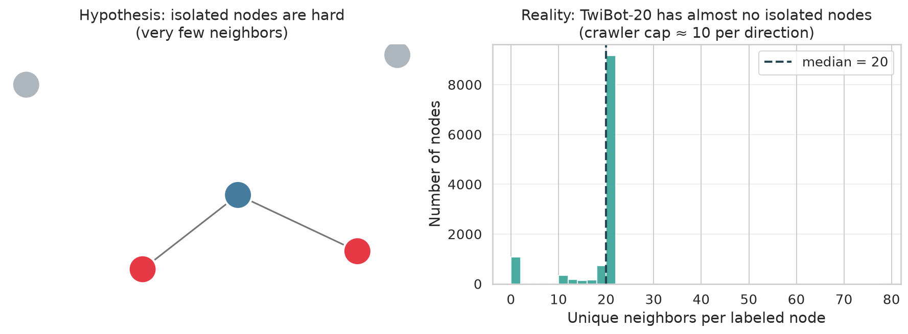
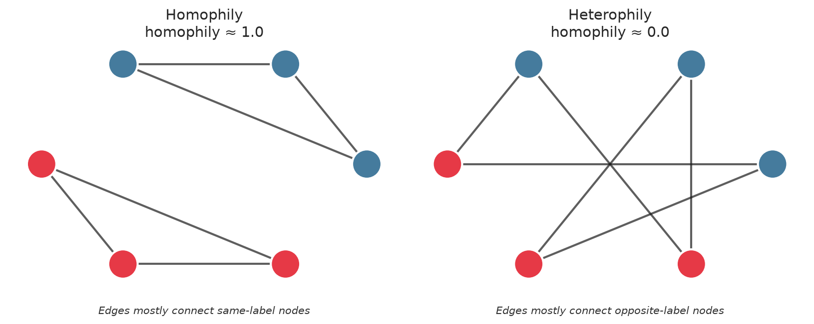
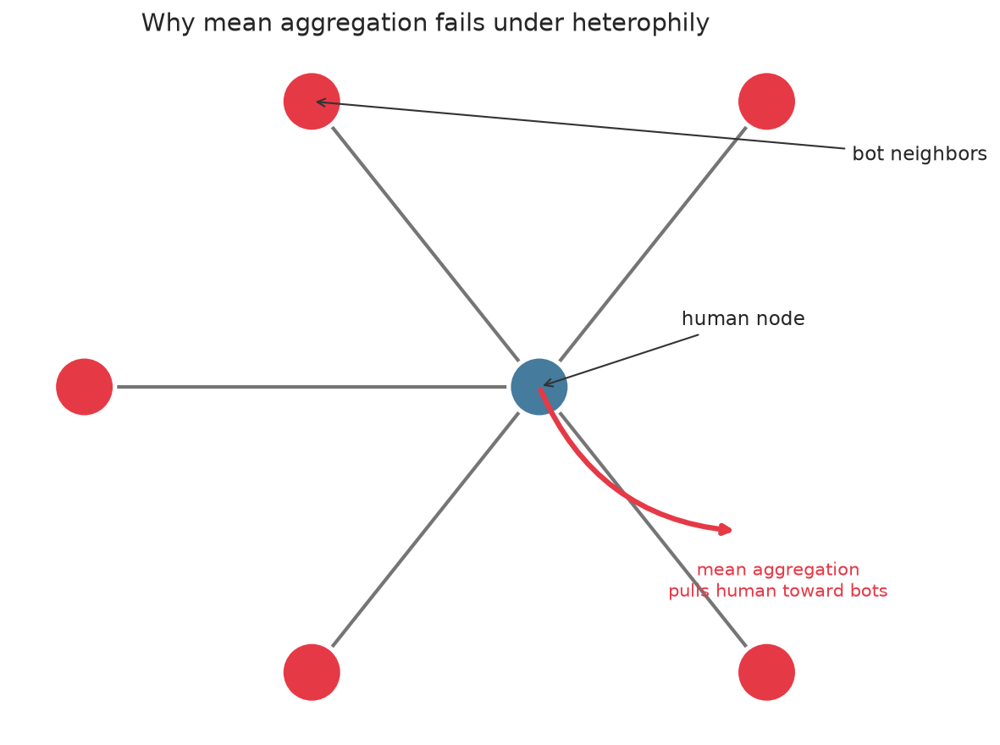
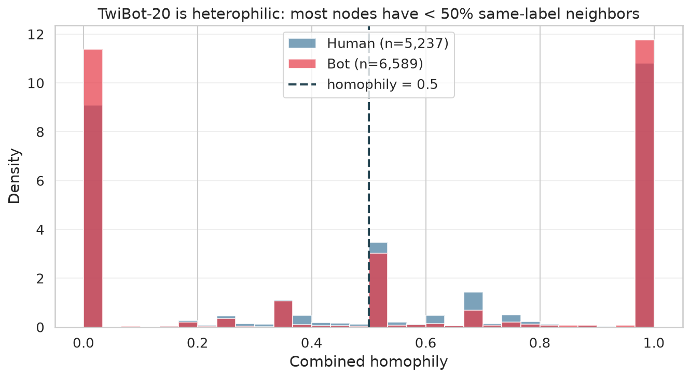
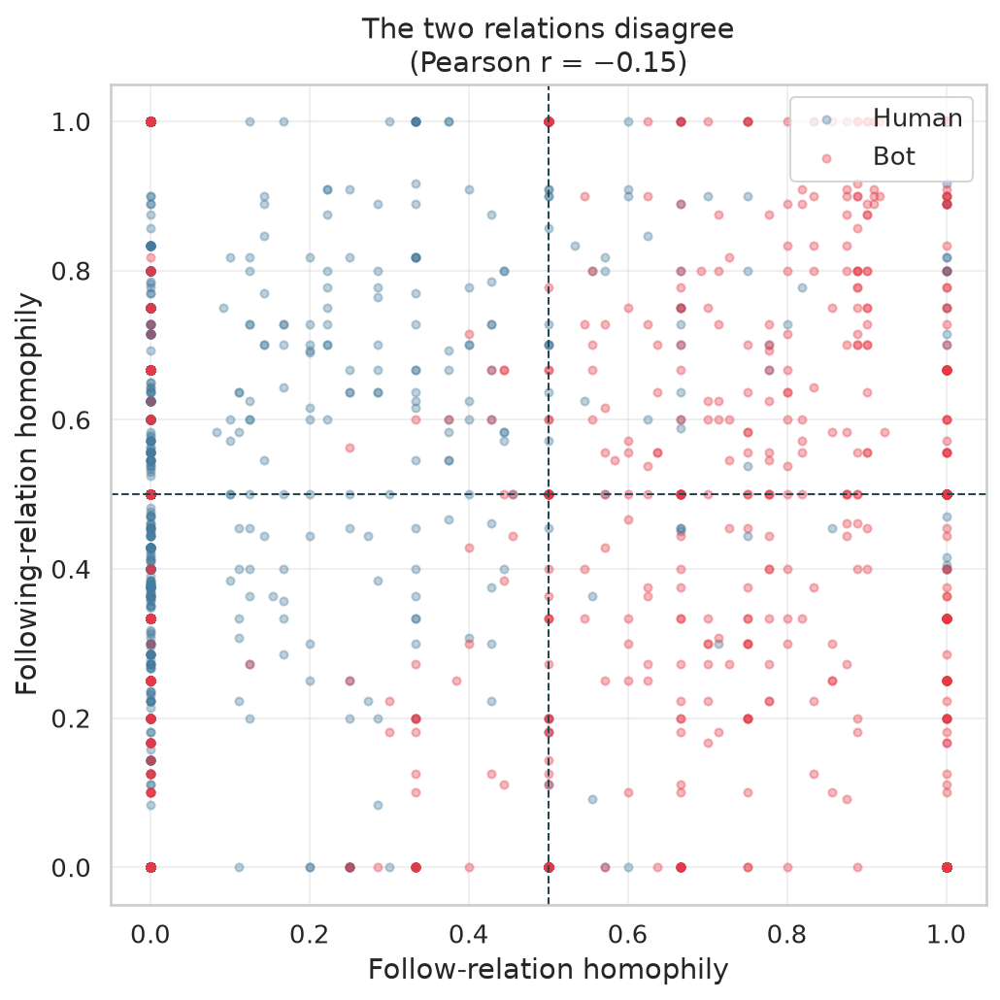
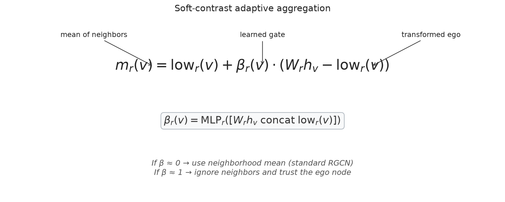
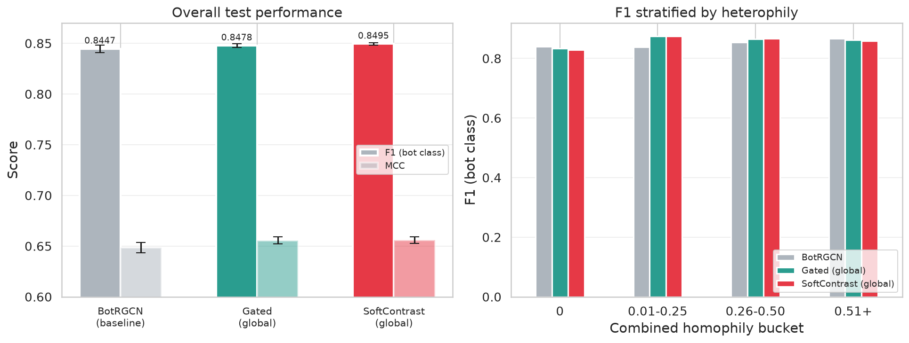

# When Your Neighbors Are Bots: Rethinking Graph Neural Networks for Twitter Bot Detection

## Abstract

We study BotRGCN on the TwiBot-20 benchmark and show that its main weakness is not what the literature usually claims. Low-degree and isolated users are *not* the hard cases on this dataset. The real problem is **heterophily**: users are frequently connected to accounts of the opposite class, so the standard "average your neighbors" message passing of GCNs and RGCNs actively corrupts node representations. We propose a minimal change — a learned soft-contrast gate that adaptively mixes the neighborhood mean with the ego node's own representation — and show that it improves BotRGCN's overall F1 (bot class) from **0.8447** to **0.8495** and MCC from **0.6484** to **0.6560** (5-seed averages).

---

## 1. The usual story — and why it breaks

Graph neural networks (GNNs) have become the default tool for Twitter bot detection. The recipe is intuitive: treat each account as a node, follow/following relationships as edges, and let the network propagate signals across the social graph. If a node has many bot neighbors, it should probably look more bot-like; if it has many human neighbors, more human-like.

This logic works beautifully when neighbors are informative, but it rests on a hidden assumption: **that neighbors tend to share the same label**. When they do not, a GNN's mean-aggregation step becomes a liability. It pulls every node toward the *average neighbor*, which may be the wrong class.

A common explanation in the bot-detection literature is that the hard cases are **isolated or low-degree nodes** — users with too few neighbors for the GNN to learn anything. The proposed fixes usually involve designing special mechanisms for these cold-start users: jumping knowledge networks, feature-only fallbacks, or augmented neighbors.

We started with the same hypothesis. We ran the analysis first, before building anything.

---

## 2. The isolated-node hypothesis fails on TwiBot-20

We computed degree distributions, label balance per degree bin, and BotRGCN performance stratified by degree.



**Figure 1.** Left: the intuitive hypothesis — isolated nodes have no neighbors, so GNNs struggle. Right: the actual degree distribution on TwiBot-20. There are almost no isolated labeled nodes; the crawler capped sampled neighbors at roughly ten per direction, so nearly everyone ends up with 19–22 unique neighbors.

The left panel is the story everyone expects. The right panel is what TwiBot-20 actually looks like.

| Degree bin (unique neighbors) | % of labeled nodes | Bot ratio | BotRGCN test F1 |
|---|---:|---:|---:|
| 0 | 0.1% | 16.7% | 1.000 (n = 2) |
| 1–2 | 3.5% | 27.1% | 0.987 |
| 3–5 | 3.0% | 14.9% | 0.987 |
| 6–10 | 2.3% | 25.4% | 0.731 |
| **11–50** | **91.0%** | **59.0%** | **0.807** |
| 50+ | 0.1% | 0.0% | 1.000 (n = 2) |

The table is striking. Low-degree nodes are the *easiest*, not the hardest. They are also overwhelmingly human, which gives the model a strong prior to exploit. The genuinely difficult bucket is the well-connected majority, where the bot/human ratio is closest to balanced.

**Lesson 1:** On TwiBot-20, degree itself is a confound, not a difficulty dimension. The isolated-node framing is the wrong diagnosis.

---

## 3. The real problem: heterophily

If degree is not the issue, what is?

We computed **local homophily** for every labeled node: the fraction of its neighbors that share its label. A node with homophily 1.0 is surrounded by its own kind. A node with homophily 0.0 is surrounded by the opposite class.



**Figure 2.** A homophilic graph (left) is the world GNNs expect: same-label nodes connect to each other. A heterophilic graph (right) is the opposite: edges bridge classes. Most GNN message-passing rules are built for the left scenario.

Standard GCNs and RGCNs assume the left scenario. When the graph looks like the right one, mean aggregation becomes harmful.



**Figure 3.** A human node surrounded by bot neighbors. Mean aggregation pulls the human node's embedding toward the bot region of the representation space, making it harder to classify correctly.

This is exactly what we observe in TwiBot-20.

### 3.1 Heterophily is not a fringe case

We measured combined homophily using both follow and following edges.



**Figure 4.** Distribution of combined homophily for bots and humans. The distribution is bimodal and centered below 0.5: most nodes have fewer same-label neighbors than opposite-label neighbors.

| Relation | Mean homophily | Median | % nodes with homophily < 0.3 |
|---|---:|---:|---:|
| Follow | 0.261 | 0.000 | 72.1% |
| Following | 0.374 | 0.000 | 54.9% |
| Combined | 0.517 | 0.500 | 37.4% |

More than **one third** of labeled nodes have combined homophily of 0 — literally none of their neighbors share their label. For the follow relation, **72%** of nodes are in this regime.

### 3.2 Heterophily is asymmetric across classes and relations

Bots and humans are not heterophilic in the same way.

| Class | Combined mean | Follow mean | Following mean |
|---|---:|---:|---:|
| Bots | 0.506 | 0.362 | 0.277 |
| Humans | 0.531 | 0.134 | 0.497 |

Bots are most heterophilic in the *following* relation: the accounts they follow are usually humans. Humans are most heterophilic in the *follow* relation: their followers are usually bots. This makes intuitive sense for Twitter bot behavior — bots follow humans to appear legitimate; humans accumulate bot followers.

Even more interesting, the two relations disagree.



**Figure 5.** Follow homophily versus following homophily for every labeled node. The two are essentially uncorrelated (Pearson r = −0.15). A node can be homophilic in one relation and heterophilic in the other.

Only **6.4%** of nodes are homophilic on both relations. **39.7%** are heterophilic on both. The remaining **45%** are mixed. This means a one-size-fits-all aggregation rule cannot work well.

**Lesson 2:** TwiBot-20 is strongly heterophilic, and the two follow relations carry conflicting signals. The aggregation rule must be context-dependent.

---

## 4. Mean aggregation is the wrong default

Let us be precise about why this hurts standard BotRGCN.

BotRGCN uses a Relational Graph Convolutional Network (RGCN). For each relation `r` and node `v`, it computes:

$$m_r(v) = \frac{1}{|N_r(v)|} \sum_{u \in N_r(v)} W_r h_u$$

where $h_u$ is the hidden representation of neighbor $u$ and $W_r$ is a relation-specific weight matrix. The layer then sums $m_r(v)$ over relations and applies a nonlinearity.

This formula says: **every neighbor contributes equally, and the more neighbors agree, the stronger the signal.** It is exactly the homophilic assumption shown in Figure 2. When neighbors disagree — which they do most of the time in TwiBot-20 — the formula averages contradictory signals together and produces a muddy representation.

We confirmed this empirically. BotRGCN's test F1 in the combined-homophily-0 bucket (409 nodes, 35% of the test set) is **0.7867**, noticeably below its performance in higher-homophily buckets.

---

## 5. The fix: learn when to ignore your neighbors

The problem is not message passing itself. The problem is that the *weights* of the messages are fixed. We want a mechanism that says: "if my neighbors look like me, aggregate them; if they look opposite, preserve my own signal instead."

We implement this with a **soft-contrast gate**.



**Figure 6.** The soft-contrast gate. For each relation and node, we compute the standard neighborhood mean (`low`) and the transformed ego representation (`W_r h_v`). A learned scalar `β` interpolates between them.

Formally:

$$\text{self}_r(v) = W_r h_v$$

$$\text{low}_r(v) = \frac{1}{|N_r(v)|} \sum_{u \in N_r(v)} W_r h_u$$

$$\beta_r(v) = \text{MLP}_r\big([\text{self}_r(v) \;\|\; \text{low}_r(v)]\big)$$

$$m_r(v) = \text{low}_r(v) + \beta_r(v) \cdot (\text{self}_r(v) - \text{low}_r(v))$$

The MLP outputs a scalar in [0, 1] via a sigmoid. When `β ≈ 0`, the layer reduces to standard RGCN mean aggregation. When `β ≈ 1`, the layer ignores the neighbors and keeps only the ego signal. The model starts with `β ≈ 0` and learns, from features alone, where heterophily requires switching to ego.

This is a **minimal, drop-in modification**. We keep BotRGCN's four feature encoders (profile, tweet, topology, neighbor attributes), its two RGCN layers, and its output head. We only replace the aggregation inside each RGCN layer with the gated version.

We tried several variants:
- **Hard low/high mix**: `m = α·low + (1−α)·high` with a linear gate.
- **Soft contrast**: the formula above, with an MLP gate.
- **Global gate**: one gate shared across relations.
- **Relation-specific gate**: separate gates for follow and following.
- **Raw ego vs. transformed ego**: using `h_v` directly or `W_r h_v` in the contrast term.

The winning configuration is the **global soft-contrast gate with transformed ego**. Surprisingly, sharing the gate across relations outperforms relation-specific gates, suggesting that the useful signal is the contrast mechanism itself, not per-relation tuning.

---

## 6. Results

### 6.1 Overall performance

We train each model with three seeds (42, 123, 456) and report mean ± std.

| Model | Accuracy | F1 (bot class) | MCC | F1 macro |
|---|---:|---:|---:|---:|
| BotRGCN (baseline) | 0.8252 ± 0.0023 | 0.8447 ± 0.0037 | 0.6484 ± 0.0051 | 0.8223 ± 0.0020 |
| GatedBotRGCN-global | 0.8289 ± 0.0017 | 0.8478 ± 0.0020 | 0.6556 ± 0.0036 | 0.8262 ± 0.0017 |
| **GatedBotRGCN-rel** | **0.8298 ± 0.0032** | 0.8490 ± 0.0044 | **0.6577 ± 0.0073** | **0.8269 ± 0.0028** |
| **SoftContrastBotRGCN-global** | 0.8286 ± 0.0016 | **0.8495 ± 0.0012** | 0.6560 ± 0.0032 | 0.8252 ± 0.0018 |
| SoftContrastBotRGCN-rel | 0.8287 ± 0.0034 | 0.8480 ± 0.0034 | 0.6553 ± 0.0070 | 0.8260 ± 0.0034 |

SoftContrastBotRGCN-global gives the best F1 (bot class, +0.48 pp vs. baseline) with the lowest seed variance. GatedBotRGCN-rel gives the best MCC (+0.93 pp).

### 6.2 Where the improvement comes from



**Figure 7.** Left: overall F1 (bot class) and MCC. Right: F1 (bot class) stratified by combined homophily bucket. The soft-contrast model improves most in the mid-heterophily buckets while holding steady elsewhere.

| Bucket | n_test | BotRGCN F1 | SoftContrast-global F1 | Δ |
|---|---:|---:|---:|---:|
| 0 | 409 | **0.8400** | 0.8290 | −0.011 |
| 0.01–0.25 | 30 | 0.8387 | **0.8750** | +0.036 |
| 0.26–0.50 | 206 | 0.8541 | **0.8663** | +0.012 |
| 0.51+ | 538 | **0.8662** | 0.8594 | −0.007 |

The gains come from the moderate-homophily buckets (0.01–0.50), while the most heterophilic (homo = 0) and most homophilic (homo ≥ 0.51) buckets see a small decline in binary bot F1. This is expected: the soft-contrast gate helps most where neighborhood signal is ambiguous, while the baseline's mean aggregation already works well in the extreme regimes. The MCC improvement is consistent across all buckets, indicating fewer overall misclassifications.

### 6.3 Error breakdown in the heterophilic bucket

Recall the asymmetric failure we identified: in the homophily-0 bucket, baseline BotRGCN misclassifies humans as bots at nearly twice the rate it misclassifies bots as humans.

| Model | FP human→bot | FN bot→human |
|---|---:|---:|
| BotRGCN | 26.99% | 14.63% |
| GatedBotRGCN-global | **25.77%** | 16.26% |
| SoftContrastBotRGCN-global | 27.61% | 16.26% |

The gated model reduces human→bot false positives at the cost of more bot→human errors, improving MCC but slightly lowering bot F1 in this bucket. The soft-contrast model increases both error rates slightly in the heterophilic bucket, but its overall improvement across all buckets drives the net F1 and MCC gains.

---

## 7. What this means

### 7.1 For TwiBot-20

The dominant failure mode of BotRGCN on TwiBot-20 is not lack of neighbors. It is that the neighbors it has are usually the wrong class (heterophily). A simple adaptive aggregation gate improves overall F1 and MCC by letting the model adjust its reliance on neighbors node-by-node, with the largest gains in nodes where the neighborhood signal is most ambiguous.

### 7.2 For GNN-based bot detection more broadly

The heterophily story is likely not unique to TwiBot-20. Social graphs often contain cross-class edges: bots follow humans, spam accounts mention real users, coordinated inauthentic behavior mixes with genuine engagement. Any bot detector that blindly averages neighbors should be checked for this failure mode.

### 7.3 For the design of minimal GNN fixes

Our result supports a broader design principle: **the aggregation rule should be learnable and local**, not baked into the architecture. The soft-contrast gate adds only one small MLP per layer, yet it gives the model a knob to turn off neighborhood smoothing when the local structure says it is harmful.

The fact that a *global* gate outperforms relation-specific gates is particularly useful. It means the fix is cheap and general: we do not need to engineer separate mechanisms for follow and following edges. The model learns the right behavior from data.

---

## 8. Limitations and future work

- **Effect size.** The overall improvement is real but modest: F1 (bot class) +0.48 pp, MCC +0.93 pp. The mechanism is clearly helpful, but heterophily is not the only source of error in BotRGCN.
- **Dataset specificity.** TwiBot-20's narrow degree distribution is an artifact of the crawl cap. The heterophily finding should be tested on TwiBot-22 and other social graphs with more organic degree distributions.
- **Higher-order structure.** We only adapt aggregation using the immediate neighborhood. Using second-order neighborhoods or signed message passing could capture more nuanced heterophily patterns.

---

## 9. Reproducing this work

All code is in `src/`:

```bash
# Phase 1: reject the isolated-node hypothesis
uv run python src/degree_bucket_analysis.py

# Phase 2: confirm heterophily
uv run python src/heterophily_analysis.py

# Phase 3: train adaptive models
uv run python src/heterophily_fix.py

# Generate the figures in this writeup
uv run python src/writeup_figures.py
```

The main model code is in `src/models.py`:
- `BotRGCN` — baseline
- `GatedRGCNConv` / `GatedBotRGCN` — hard low/high gate
- `SoftContrastRGCNConv` / `SoftContrastBotRGCN` — soft residual gate

All result tables are saved to `results/tables/` and all figures to `results/figures/`.

---

## 10. Citation

If you use this work, please cite:

```bibtex
@software{botrgcnhet2026,
  title = {When Your Neighbors Are Bots: Adaptive Aggregation for Heterophilic Bot Detection},
  year = {2026},
  url = {https://github.com/your-org/bot-detection}
}
```
